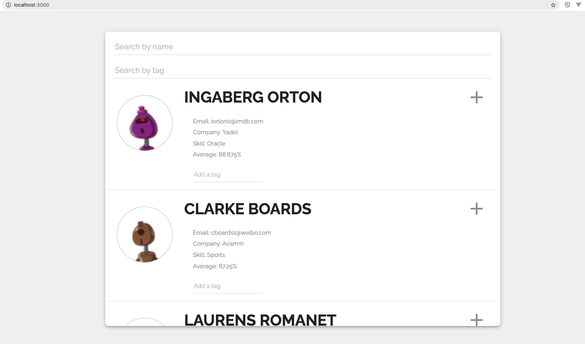

# Frontend Assessment - Student Profiles

# Setup

Install dependencies with `npm install`.

## Running Webpack Development Server

```sh
npm start
```

The server will run on `localhost` with port `3000`
&nbsp;&nbsp;


# Screen Shots




&nbsp;

# Feature

- Fetching student data from this public JSON API

- The expansion will toggle if the plus button is clicked on

- A user can filter the list of students by their name (including full name!)

- If a name is entered in the search by name input, and a tag is entered in the search by tag input, results that include both the name and tag should be shown